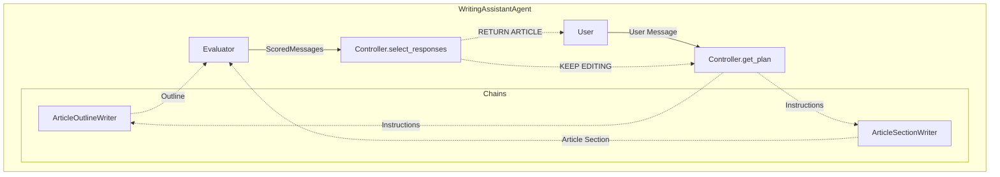

# Advanced Tutorial: Creating a research writing assistant with Council

**Heads up!** If you want to skip to the end and try out the finished code, you can find it in this [repository](https://github.com/chain-ml/council-writing-assistant).

Council is an agent-based framework for composable AI. It provides an opinionated but flexible set of abstractions that encourages the division of AI tasks into more specialized functions and roles. This tutorial is the first in a series that will explore how Council can be used to create a powerful research assistant. Over the next few weeks, we will extend the tutorial with lots of new features. If you haven't read the **Getting Started** material, we recommend going back to read those first. 

## Motivation
Suppose that you want to ask an LLM to "*Write a detailed research article about the history of box manufacturing.*" This is quite a high-level goal to give an LLM. That said, GPT-4 will handle this by writing a coherent and fairly detailed article. While certainly impressive, we think that GPT-4 and other LLMs can do better and go further with a little bit of *planning*. Using Council, and especially the **Controller** abstraction, we can implement a custom agent that leverages planning to write more detailed articles. 

## Solution Architecture

In this first tutorial, we're going to start relatively simply and build a single Agent with just two Chains (with only one skill each) - one for writing article outlines (planning) and another for writing article sections (writing). For now, we won't define any additional skills that could be useful for research (e.g. web search) - but we'll add these later in this tutorial series, so stay tuned. Instead, we're going to focus on leveraging the **Controller** abstraction to enable iterative planning and refinement. 

As such, our solution will have these components:
- Two Skills: `OutlineWriterSkill` and `SectionWriterSkill`
- Two Chains (with one Skill each): `outline_chain` and `writer_chain`
- A customized Controller: `WritingAssistantController`
- A (minimally) customized Evaluator: `BasicEvaluatorWithSource`

Before diving into the code, let's take a look at our solution architecture. Dotted lines indicate conditional/flexible flow, while solid lines always execute.



**User Messages** will first be handled by the Controller - specifically its `get_plan` function. It uses an LLM call to create an execution plan that involves its Chains. In contrast to Council's built-in LLMController, our custom Controller will generate an execution plan that includes **instructions** and other **state values**. In other words, the Controller will decide not only which Chains to add to the execution plan, but also *how* to execute them. 

For example, in an Agent's first iteration of handling a User Message, it may only return a plan to invoke `ArticleOutlineWriter`. In the second iteration, the Controller may return a plan to invoke the `ArticleSectionWriter` many times, each with instructions for different sections to write. 

After Chains and their underlying Skills have been executed according to the Controller's plan, they will passed into an Evaluator. In this tutorial installment, we're using a very minimally customized `BasicEvaluator` - the small change will be explained later. As such, the Evaluator is effectively a pass-through for now. In the coming weeks, we'll show how customized Evalutors can significantly increase the quality of generated articles - so stay tuned for that, too!

After Evaluation is complete, the Controller's `select_responses` function is always invoked. This function is responsible for interpreting the Evaluator's input and deciding whether to return a result to the "requesting agent" (which could be a human user or another Council agent). In this solution, an LLM call is used to review all of the progress made so far and decide whether to `KEEP EDITING` or to `RETURN ARTICLE`. 

## Demo

Before we get to the implementation, let's take a look at an example of what this solution can produce.

### User Message

Let's start with the following user message:

```
Write a detailed research article about the history of box manufacturing.
```

#### Output From GPT-4 Called Directly

For comparison, see [here](./example_article_gpt4.md) for the output from GPT-4 using the same initial prompt. The output has 683 words.

### `Controller.get_plan`

The first step in Agent execution is to call the Controller's `get_plan` function. Here is the plan it returns:

```
Outline Writer;10;Create an outline for the research article about the history of box manufacturing. The outline should include the following sections: Introduction, Early History, Industrial Revolution, Modern Box Manufacturing, and Conclusion.

Article Writer;8;Once the outline is complete, start writing the Introduction section. Provide a brief overview of the topic and its significance.
```

This plan is a great starting point. The controller sensibly decides to begin with writing an outline and to follow up with an introduction section.

### Chain Execution

After a Controller has generated a plan, Agents proceed with Chain execution. Let's look at the output from these Chain executions.

#### Initial Outline
```markdown
# Introduction
## Brief overview of box manufacturing
## Importance of studying the history of box manufacturing
## Scope of the research

# Early History of Box Manufacturing
## Early uses and types of boxes
## Evolution of box designs and materials
## Key pioneers and their contributions

# Industrial Revolution and Box Manufacturing
## Impact of the industrial revolution on box manufacturing
## Technological advancements in box production
## Emergence of mass production and its effects

# Modern Box Manufacturing
## Current methods and materials in box manufacturing
## Role of automation and digital technology
## Environmental considerations and sustainability in box manufacturing

# Conclusion
## Recap of the evolution of box manufacturing
## Current trends and future prospects
## Final thoughts and reflections
```

#### Initial Article

The Article after 1 iteration has 712 words - a few more than the 683-word Article produced by GPT-4 directly.

```markdown
# Introduction

The history of box manufacturing is a fascinating journey that traces the evolution of a simple yet essential item in our daily lives. The box, in its various forms and materials, has been a cornerstone of commerce, storage, and transportation for centuries. This article aims to delve into the rich history of box manufacturing, exploring its origins, development, and the technological advancements that have shaped it over time.

The significance of box manufacturing cannot be overstated. Boxes are ubiquitous, serving a myriad of purposes in different sectors. From packaging consumer goods to storing valuable items, from facilitating global trade to aiding in logistics and supply chain management, boxes play a crucial role. They are an integral part of our economy and society, and their production and use have significant environmental implications.

Understanding the history of box manufacturing provides valuable insights into the evolution of industrial processes, technological innovation, and societal change. It sheds light on how we have managed to efficiently package, store, and transport goods across vast distances. Moreover, it highlights the challenges and opportunities in the industry, informing future directions for sustainable and innovative box manufacturing.

# Early History of Box Manufacturing

In the early days, boxes were primarily made of wood and were used for storage and transportation of goods. The design and size of the boxes varied depending on their intended use. For instance, large wooden crates were used for transporting heavy goods, while smaller boxes were used for storing personal items.

The evolution of box designs and materials was driven by the need for more efficient and durable packaging solutions. The introduction of cardboard in the 19th century marked a significant milestone in the history of box manufacturing. Cardboard boxes were lighter, cheaper, and easier to produce than wooden boxes, making them an ideal choice for packaging consumer goods.

Key pioneers in the field of box manufacturing include Robert Gair, who invented the pre-cut cardboard box in 1890. This innovation significantly reduced the time and effort required to assemble boxes, paving the way for mass production.

# Industrial Revolution and Box Manufacturing

The industrial revolution had a profound impact on box manufacturing. The advent of steam-powered machinery and the development of assembly line techniques enabled the mass production of boxes. This not only increased the efficiency and speed of box production but also reduced the cost, making boxes more accessible to a wider market.

Technological advancements in box production continued throughout the 20th century. The invention of corrugated cardboard in the 1950s, for example, provided a more durable and versatile material for box manufacturing. Corrugated boxes quickly became the standard for shipping and packaging, thanks to their strength and lightweight properties.

The emergence of mass production also had significant effects on the industry. It led to the standardization of box sizes and designs, facilitating easier storage and transportation. Moreover, it opened up new opportunities for branding and marketing, as companies began to use boxes as a medium for advertising their products.

# Modern Box Manufacturing

Today, box manufacturing is a highly automated process. Modern factories use advanced machinery and digital technology to produce boxes of various sizes and designs. The use of computer-aided design (CAD) and computer-aided manufacturing (CAM) has further streamlined the production process, allowing for greater precision and customization.

Environmental considerations have also become a key factor in box manufacturing. With growing awareness of the environmental impact of packaging waste, manufacturers are increasingly focusing on sustainability. This has led to the development of eco-friendly materials and recycling programs, as well as efforts to reduce the overall use of packaging.

# Conclusion

The history of box manufacturing is a testament to human ingenuity and innovation. From the simple wooden crates of the past to the high-tech, eco-friendly boxes of today, the industry has continually evolved to meet the changing needs of society.

As we look to the future, the trend towards automation and sustainability is likely to continue. With advancements in technology and a growing emphasis on environmental responsibility, the box manufacturing industry is poised for further innovation and development.

In conclusion, the humble box, often overlooked and taken for granted, has a rich and fascinating history. Its evolution reflects broader trends in industrialization, technology, and society, offering valuable insights into our past and potential directions for our future.
```


### Evaluation

After the initial Chain executions are complete, our Agent will enter the Evaluation phase. In this solution, the Evaluator is just checking to see if Chains executed successfully. In future tutorial installments, we'll show how Evaluators can be used for a wide variety of tasks including fact checking and bias detection. For now, we'll just proceed to aggregation.

### Aggregation and Iteration

After Evaluation is complete, the Controller's `select_responses` function will be invoked. In this solution, we've added logic to make up to three additional LLM calls to:
1. Aggregate Outlines, if more than one was generated in the last iteration
2. Aggregate Article Sections, if more than one was generated in the last iteration
3. Decide whether the aggregated Article needs more editing or can be returned to the requesting agent

The implementation logic for each of these steps is largely in their respective prompts, which we'll see as we walk through the code. The important thing to keep in mind for now is that our Agent has the ability to iteratively improve the Outline and the Article automatically. In this example run, the Agent completed one more iterations before returning the Article:

#### Article After 2 Iterations

After one more iteration, we now have an Article with 1559 words! Yes, some of the content is repetitive, but we'll work to improve this in future tutorial installments.

```markdown
# Introduction

The history of box manufacturing is a captivating exploration that traces the evolution of a simple yet indispensable item in our daily lives. The box, in its various forms and materials, has been a fundamental component of commerce, storage, and transportation for centuries. This article aims to delve into the rich history of box manufacturing, exploring its origins, development, and the technological advancements that have shaped it over time.

The significance of box manufacturing cannot be overstated. Boxes are ubiquitous, serving a myriad of purposes in different sectors. From packaging consumer goods to storing valuable items, from facilitating global trade to aiding in logistics and supply chain management, boxes play a crucial role. They are an integral part of our economy and society, and their production and use have significant environmental implications.

Understanding the history of box manufacturing provides valuable insights into the evolution of industrial processes, technological innovation, and societal change. It sheds light on how we have managed to efficiently package, store, and transport goods across vast distances. Moreover, it highlights the challenges and opportunities in the industry, informing future directions for sustainable and innovative box manufacturing.

# Early History of Box Manufacturing

The early history of box manufacturing is as diverse as the uses of the boxes themselves. Initially, boxes were primarily made of wood and were used for a variety of purposes. Large wooden crates were used for transporting heavy goods such as machinery and agricultural products, while smaller, intricately designed boxes were used for storing personal items like jewelry and documents. Some boxes were even used as burial containers in ancient civilizations.

The evolution of box designs and materials was driven by the need for more efficient and durable packaging solutions. The introduction of cardboard in the 19th century marked a significant milestone in the history of box manufacturing. Cardboard boxes were lighter, cheaper, and easier to produce than wooden boxes, making them an ideal choice for packaging consumer goods. They were also more versatile, as they could be easily shaped and customized to fit a wide range of products.

Key pioneers in the field of box manufacturing include Robert Gair, a paper bag maker from Brooklyn, who invented the pre-cut cardboard box in 1890. Gair's invention was a result of a fortunate accident: a press knife mistakenly cut through thousands of seed bags instead of pressing them. This led Gair to the idea of creating a machine that could cut and crease cardboard in one operation. This innovation significantly reduced the time and effort required to assemble boxes, paving the way for mass production. Another notable figure is Albert Jones of New York, who patented the first corrugated cardboard box in 1871. Jones' invention provided a stronger and more durable alternative to the traditional wooden crates, revolutionizing the packaging industry.

# Industrial Revolution and Box Manufacturing

The Industrial Revolution, a period of rapid industrialization from the mid-18th to mid-19th century, brought about significant changes in agriculture, manufacturing, mining, and transport that had a profound effect on the socio-economic and cultural conditions of the time. One of the industries that was greatly impacted by this revolution was box manufacturing.

The Industrial Revolution had a profound impact on box manufacturing, transforming it from a labor-intensive, manual process to a mechanized, efficient one. Prior to the revolution, boxes were primarily made by hand, which was a time-consuming and costly process. The advent of steam-powered machinery and assembly line techniques during the Industrial Revolution enabled the mass production of boxes. This not only increased the efficiency and speed of box production but also significantly reduced the cost, making boxes more accessible to a wider market. The revolution also led to the development of new materials and designs, further enhancing the versatility and utility of boxes.

Technological advancements in box production continued throughout the 20th century. The invention of corrugated cardboard in the 1950s, for example, provided a more durable and versatile material for box manufacturing. Corrugated boxes quickly became the standard for shipping and packaging, thanks to their strength, lightweight properties, and cost-effectiveness.

The emergence of mass production techniques during the Industrial Revolution had significant effects on the box manufacturing industry. It led to the standardization of box sizes and designs, which facilitated easier storage and transportation. This standardization also made it possible to produce boxes in large quantities, meeting the growing demand for packaging in the burgeoning consumer goods industry.

Mass production also opened up new opportunities for branding and marketing. Companies began to use boxes not just as a means of packaging and transporting goods, but also as a medium for advertising their products. This led to the development of printed boxes, which allowed companies to display their logos, product information, and other marketing messages directly on the box.

# Modern Box Manufacturing

In the contemporary era, box manufacturing has evolved into a sophisticated industry, leveraging cutting-edge technologies and innovative materials. The process has become highly automated, with a strong emphasis on efficiency, precision, and sustainability.

Modern box manufacturing methods have been revolutionized by the advent of automation and digital technology. The process typically begins with the design phase, where box specifications such as dimensions, material type, and print design are determined. Computer-aided design (CAD) software is often used in this phase to create precise and customizable box designs.

The materials used in box manufacturing have also evolved. While cardboard remains a popular choice due to its cost-effectiveness and versatility, other materials like plastic, metal, and even glass are used for specific applications. For instance, plastic boxes are often used for food packaging due to their durability and resistance to moisture, while metal and glass boxes are used for high-end products like perfumes and spirits.

Automation plays a pivotal role in modern box manufacturing. Automated machines are used to cut, fold, and glue the boxes, significantly increasing the speed and efficiency of the production process. These machines can produce large quantities of boxes in a short amount of time, reducing labor costs and increasing productivity.

Digital technology has also transformed the industry. Computer-aided manufacturing (CAM) systems are used to control the machinery, ensuring precision and consistency in box production. Moreover, digital printing technology has enabled high-quality, customizable prints on boxes, enhancing their aesthetic appeal and marketing potential.

Sustainability has become a key consideration in box manufacturing. The industry faces increasing pressure to reduce its environmental impact, leading to several initiatives aimed at promoting sustainability. These include the use of recycled or recyclable materials, reducing waste in the production process, and implementing energy-efficient manufacturing practices.

Many manufacturers are also exploring the use of alternative, eco-friendly materials. For instance, biodegradable plastics and plant-based materials are being used to create sustainable packaging solutions. Additionally, companies are investing in research and development to innovate new, environmentally-friendly box designs and manufacturing processes.

# Conclusion

The history of box manufacturing is a captivating narrative that mirrors the broader evolution of human society, industrial processes, and technological advancements. It began with the rudimentary wooden boxes of the early days, which were primarily used for storage and transportation of goods. The design and size of these boxes were dictated by their intended use, with larger crates for heavy goods and smaller boxes for personal items.

The introduction of cardboard in the 19th century marked a significant turning point in the history of box manufacturing. Cardboard boxes, being lighter, cheaper, and easier to produce, revolutionized the packaging industry. This innovation was further propelled by pioneers like Robert Gair, whose invention of the pre-cut cardboard box in 1890 paved the way for mass production.

The Industrial Revolution brought about transformative changes in box manufacturing. The advent of steam-powered machinery and assembly line techniques enabled mass production, making boxes more accessible to a wider market. Technological advancements, such as the invention of corrugated cardboard in the 1950s, provided more durable and versatile materials for box manufacturing, setting new standards for shipping and packaging.

In the modern era, box manufacturing has become a highly automated process, with advanced machinery and digital technology playing a pivotal role. The use of computer-aided design (CAD) and computer-aided manufacturing (CAM) has streamlined the production process, allowing for greater precision and customization.

Environmental considerations have also come to the forefront in box manufacturing. With the growing awareness of the environmental impact of packaging waste, manufacturers are increasingly focusing on sustainability. This has led to the development of eco-friendly materials and recycling programs, as well as efforts to reduce the overall use of packaging.

Looking ahead, the box manufacturing industry is poised for further innovation and development. The trend towards automation and sustainability is likely to continue, driven by advancements in technology and a growing emphasis on environmental responsibility. We may also see the emergence of new materials and designs, as manufacturers strive to meet the changing needs of consumers and businesses.

In conclusion, the evolution of box manufacturing offers a fascinating glimpse into our past, while also providing valuable insights into our future. The humble box, often overlooked and taken for granted, has played a crucial role in our society and economy. Its story is a testament to human ingenuity and innovation, reminding us of our capacity to adapt and evolve in the face of changing circumstances. As we continue to navigate the challenges and opportunities of the 21st century, the lessons from the history of box manufacturing will undoubtedly serve as a valuable guide.
```

### Remarks

After 2 iterations, the Article has a lot more detail. It better reflects the Outline generated in the first iteration, and is much more detailed. You can go even further with this example by running and extending [run_agent.ipynb](../run_agent.ipynb)

## Next Steps

The tutorial breaks down the [solution](https://github.com/chain-ml/council-writing-assistant) sequentially:
1. [Intro (this page)](./1_intro.md)
2. [Outline Writer Skill](./2_outline_writer_skill.md)
3. [Section Writer Skill](./3_article_section_writer_skill.md)
4. [Controller](./4_controller.md)
5. [Evaluator](./5_evaluator.md)
6. [Agent App](./6_agent.md)


