# Advanced Tutorial: Creating a research writing assistant with Council

**Heads up!** If you want to skip to the end and try out the finished code, you can find it in this [repository](https://github.com/chain-ml/council-writing-assistant).

Council is an agent-based framework for composable AI. It provides an opinionated but flexible set of abstractions that encourages the division of AI tasks into more specialized functions and roles. This tutorial is the first in a series that will explore how Council can be used to create a powerful research assistant. Over the next few weeks, we will extend the tutorial with lots of new features. If you haven't read the **Getting Started** material, we recommend going back to read those first. 

## Motivation
Suppose that you want to ask an LLM to "Write a research article about the history of video games." This is quite a high-level goal to give an LLM. That said, GPT-4 will handle this by writing a coherent article with around 10 top level sections consisting of one paragaraph each. While certainly impressive, we think that GPT-4 and other LLMs can do better and go further with a little bit of *planning*. Using Council, and especially the **Controller** abstraction, we can implement a custom agent that leverages planning to write more detailed articles. 

## Solution Architecture

In this first tutorial, we're going to start relatively simply and build a single Agent with just two Chains (with only one skill each) - one for writing article outlines (planning) and another for writing article sections (writing). For now, we won't define any additional skills that could be useful for research (e.g. web search) - but we'll add these later in this tutorial series, so stay tuned. Instead, we're going to focus on leveraging the **Controller** abstraction to enable iterative planning and refinement. 

As such, our solution will have these components:
- Two Skills: `OutlineWriterSkill` and `SectionWriterSkill`
- Two Chains (with one Skill each): `outline_chain` and `writer_chain`
- A customized Controller: `WritingAssistantController`
- A (minimally) customized Evaluator: `BasicEvaluatorWithSource`

Before diving into the code, let's take a look at our solution architecture. Dotted lines indicate conditional/flexible flow, while solid lines always execute.



**User Messages** will first be handled by the Controller - specifically its `get_plan` function. It uses an LLM call to create an execution plan that involves its Chains. In contrast to Council's built-in LLMController, our custom Controller will generate an execution plan that includes **instructions** and other **state values**. In other words, the Controller will decide not only which Chains to add to the execution plan, but also *how* to execute them. 

For example, in an Agent's first iteration of handling a User Message, it may only return a plan to invoke `ArticleOutlineWriter`. In the second iteration, the Controller may return a plan to invoke the `ArticleSectionWriter` many times, each with instructions for different sections to write. 

After Chains and their underlying Skills have been executed according to the Controller's plan, they will passed into an Evaluator. In this tutorial installment, we're using a very minimally customized `BasicEvaluator` - the small change will be explained later. As such, the Evaluator is effectively a pass-through for now. In the coming weeks, we'll show how customized Evalutors can significantly increase the quality of generated articles - so stay tuned for that, too!

After Evaluation is complete, the Controller's `select_responses` function is always invoked. This function is responsible for interpreting the Evaluator's input and deciding whether to return a result to the "requesting agent" (which could be a human user or another Council agent). In this solution, an LLM call is used to review all of the progress made so far and decide whether to `KEEP EDITING` or to `RETURN ARTICLE`. 

## Demo

Before we get to the implementation, let's take a look at a sample sequence of messages.

### User Message

Let's start with the following user message:

```
Write a detailed research article about the history of video games.
```

### `Controller.get_plan`

The first step in Agent execution is to call the Controller's `get_plan` function. Here is the plan it returns:

```
Outline Writer;10;Create an outline for the research article about the history of video games. The outline should include sections such as Introduction, Early History, Evolution of Video Games, Impact on Society, and Conclusion.
Article Writer;8;Once the outline is ready, start writing the Introduction section, providing a brief overview of the topic and what the article will cover.
```

This plan is a great starting point. The controller sensibly decides to begin with writing an outline and to follow up with an introduction section.

### Chain Execution

After a Controller has generated a plan, Agents proceed with Chain execution. Let's look at the output from these Chain executions.

#### Initial Outline
```markdown
# Introduction
- Brief overview of the topic
- Importance of understanding the history of video games

# Early History of Video Games
- The first video games: origins and pioneers
- The birth of arcade games
- The advent of home consoles

# Evolution of Video Games
- Transition from 2D to 3D gaming
- The rise of online gaming
- The impact of mobile gaming
- The advent of virtual and augmented reality games

# Impact on Society
- The economic impact of the video game industry
- The influence of video games on popular culture
- The role of video games in education and skill development
- Controversies and criticisms: violence, addiction, and social isolation

# Conclusion
- Recap of the evolution and impact of video games
- The future of video games: trends and predictions
```

#### Initial Article

```markdown
# The History of Video Games: A Detailed Exploration

## Introduction

The history of video games is a fascinating journey that spans over half a century, from the rudimentary designs of the 1950s to the sophisticated, immersive games of the 21st century. This article will delve into the evolution of video games, tracing their origins, the technological advancements that have shaped them, and the cultural impact they have had over the years.

## The Early Beginnings

We will explore the early beginnings of video games, starting with the creation of the first known video game, "Tennis for Two," in 1958. This game, though simple by today's standards, marked the beginning of a new era in entertainment.

## The Birth of the Arcade Era

The 1970s marked the birth of the arcade era, with the release of iconic games like "Pong" and "Space Invaders." These games not only revolutionized the gaming industry but also became cultural phenomena, influencing popular culture and paving the way for future video games.

## The Rise of Home Consoles and 3D Gaming

The 1980s and 1990s saw the rise of home consoles and the shift towards 3D gaming. Major players in the industry, such as Nintendo, Sega, and Sony, emerged during this time. Their rivalry spurred innovation and growth in the industry, leading to the creation of some of the most memorable and influential video games in history.

## The Current State of Video Games

Today, video games have evolved far beyond their humble beginnings. The rise of online gaming has allowed players from around the world to connect and compete in a virtual arena. The advent of virtual and augmented reality has created new possibilities for immersive gaming experiences. Moreover, the increasing popularity of mobile gaming has made video games more accessible than ever before.

## Societal Implications of Video Games

Video games have also had significant societal implications. They have become a part of popular culture, influencing music, film, and art. Furthermore, they have shown potential as educational tools, helping to develop problem-solving skills and promote creativity.

Join us as we embark on this journey through the history of video games, a testament to human creativity and technological progress.
```

### Evaluation

After the initial Chain executions are complete, our Agent will enter the Evaluation phase. In this solution, the Evaluator is just checking to see if Chains executed successfully. In future tutorial installments, we'll show how Evaluators can be used for a wide variety of tasks including fact checking and bias detection. For now, we'll just proceed to aggregation.

### Aggregation and Iteration

After Evaluation is complete, the Controller's `select_responses` function will be invoked. In this solution, we've added logic to make up to three additional LLM calls to:
1. Aggregate Outlines, if more than one was generated in the last iteration
2. Aggregate Article Sections, if more than one was generated in the last iteration
3. Decide whether the aggregated Article needs more editing or can be returned to the requesting agent

The implementation logic for each of these steps is largely in their respective prompts, which we'll see as we walk through the code. The important thing to keep in mind for now is that our Agent has the ability to iteratively improve the Outline and the Article automatically. In this example run, the Agent completed 3 full iterations before returning the Article:

#### Article After 3 Iterations

```markdown
# The History of Video Games: A Detailed Exploration

## Introduction

The history of video games is a fascinating journey that spans over half a century, from the rudimentary designs of the 1950s to the sophisticated, immersive games of the 21st century. This article will delve into the evolution of video games, tracing their origins, the technological advancements that have shaped them, and the cultural impact they have had over the years.

## The Early Beginnings

We will explore the early beginnings of video games, starting with the creation of the first known video game, "Tennis for Two," in 1958. Developed by physicist William Higinbotham, this game, though simple by today's standards, marked the beginning of a new era in entertainment.

## The Birth of the Arcade Era

The 1970s marked the birth of the arcade era, with the release of iconic games like "Pong" and "Space Invaders." These games, developed by pioneers such as Nolan Bushnell and Toshihiro Nishikado, not only revolutionized the gaming industry but also became cultural phenomena, influencing popular culture and paving the way for future video games.

The advent of home consoles began in the late 1970s and early 1980s, with companies like Atari and Magnavox leading the way. The release of the Atari 2600 and the Magnavox Odyssey marked a significant shift in the gaming landscape, bringing video games from arcades into living rooms around the world.

## The Rise of Home Consoles and 3D Gaming

The 1980s and 1990s saw the rise of home consoles and the shift towards 3D gaming. Major players in the industry, such as Nintendo, Sega, and Sony, emerged during this time. Their rivalry spurred innovation and growth in the industry, leading to the creation of some of the most memorable and influential video games in history.

## Evolution of Video Games

The evolution of video games has been marked by several significant milestones. The transition from 2D to 3D gaming in the late 1980s and early 1990s, led by companies like Nintendo, Sega, and Sony, brought a new level of realism and immersion to video games. This shift was a game-changer, paving the way for the creation of some of the most memorable and influential video games in history.

The late 1990s and early 2000s saw the rise of online gaming, with games like "EverQuest" and "World of Warcraft" allowing players from around the world to connect and compete in a virtual arena. This development not only transformed the gaming experience but also fostered a sense of community among gamers.

The advent of smartphones in the mid-2000s led to a surge in mobile gaming. Games like "Angry Birds" and "Candy Crush Saga" became cultural phenomena, making gaming more accessible than ever before and expanding the demographic of gamers.

The most recent development in the evolution of video games is the advent of virtual and augmented reality games. These technologies have created new possibilities for immersive gaming experiences, blurring the line between the virtual and real worlds.

## Impact on Society

Video games have had a profound impact on society in various ways. 

### The Economic Impact of the Video Game Industry

The video game industry has grown into a multi-billion dollar industry, contributing significantly to the global economy. It has created jobs, spurred technological innovation, and generated substantial revenue from sales and services related to gaming.

### The Influence of Video Games on Popular Culture

Video games have become a significant part of popular culture, influencing music, film, and art. Characters and narratives from video games have permeated other forms of media, and gaming terminology has entered everyday language.

### The Role of Video Games in Education and Skill Development

Video games have shown potential as educational tools, helping to develop problem-solving skills, promote creativity, and enhance cognitive abilities. They are increasingly being used in classrooms and in professional training environments.

### Controversies and Criticisms: Violence, Addiction, and Social Isolation

Despite the positive impacts, video games have also been the subject of controversy and criticism. Concerns have been raised about the potential link between violent video games and aggressive behavior. Issues of addiction and social isolation have also been associated with excessive gaming.

## Conclusion

As we conclude our journey through the history of video games, we can see the profound impact they have had on society. From their early beginnings with "Tennis for Two," to the arcade era with games like "Pong" and "Space Invaders," to the rise of home consoles and 3D gaming, and finally to the current state of online, mobile, and virtual reality gaming, video games have evolved to become a significant part of our culture and everyday lives.

Looking ahead, the future of video games is promising and full of exciting possibilities. Trends suggest a continued growth in online and mobile gaming, further advancements in virtual and augmented reality technologies, and an increasing use of video games in education and skill development. As we move forward, we can expect video games to continue to evolve, innovate, and influence society in ways we can only begin to imagine.
```

### Remarks

After 3 iterations, the Article is in much better shape. It better reflects the Outline generated in the first iteration, and is much more detailed. You can go even further with this example by running and extending [run_agent.ipynb](../run_agent.ipynb)

## Next Steps

The remainder of this tutorial breaks down the [solution](https://github.com/chain-ml/council-writing-assistant) sequentially:
1. [Outline Writer Skill](./2_outline_writer_skill.md)
2. [Section Writer Skill](./3_article_section_writer_skill.md)
3. [Controller](./4_controller.md)
4. [Evaluator](./5_evaluator.md)
5. [Agent App](./6_agent.md)


